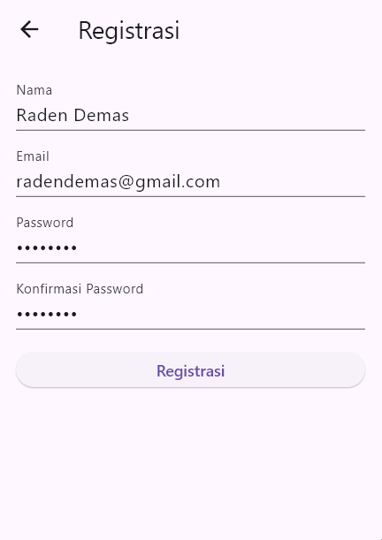
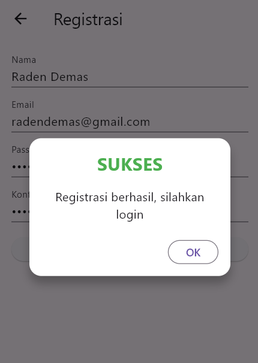
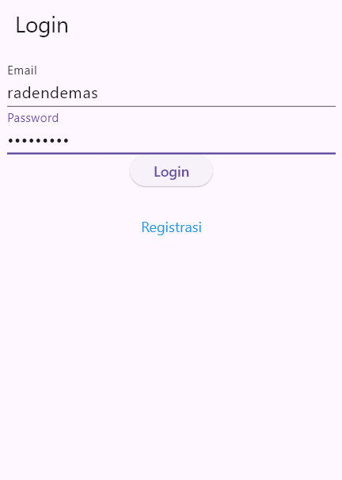
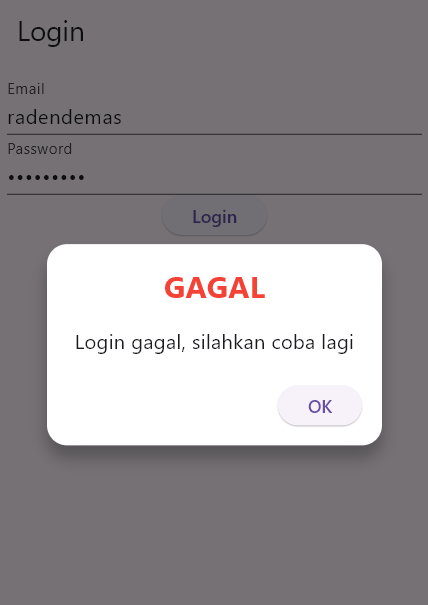
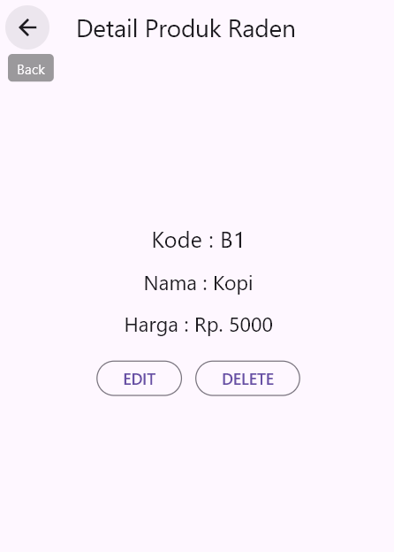
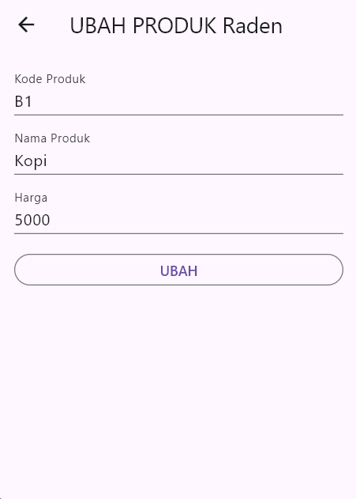
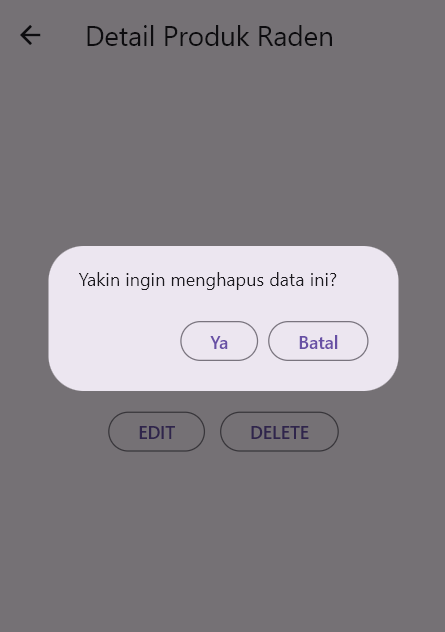
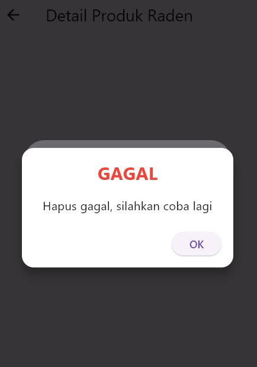
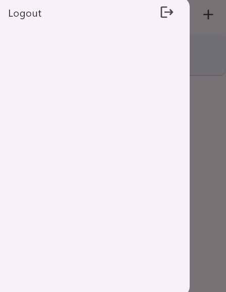

# Toko Kita - Aplikasi Manajemen Produk

Aplikasi Flutter untuk mengelola produk toko dengan fitur CRUD (Create, Read, Update, Delete).

## Penjelasan Sistem Aplikasi

### 1. Proses Registrasi

Proses registrasi memungkinkan pengguna baru untuk membuat akun.

a. **Form Registrasi**  
   
 Pengguna mengisi form dengan nama, email, password, dan konfirmasi password. Validasi dilakukan untuk memastikan data lengkap dan valid.

b. **Popup Berhasil Registrasi**  
 
Setelah registrasi berhasil, muncul dialog sukses yang mengarahkan pengguna untuk login. Jika gagal, muncul dialog peringatan.

**Kode `registrasi_page.dart` :**

```dart
void _submit() {
  _formKey.currentState!.save();
  setState(() {
    _isLoading = true;
  });
  RegistrasiBloc.registrasi(
    nama: _namaTextboxController.text,
    email: _emailTextboxController.text,
    password: _passwordTextboxController.text,
  ).then(
    (value) {
      showDialog(
        context: context,
        barrierDismissible: false,
        builder: (BuildContext context) => SuccessDialog(
          description: "Registrasi berhasil, silahkan login",
          okClick: () {
            Navigator.pop(context);
          },
        ),
      );
    },
    onError: (error) {
      showDialog(
        context: context,
        barrierDismissible: false,
        builder: (BuildContext context) => const WarningDialog(
          description: "Registrasi gagal, silahkan coba lagi",
        ),
      );
    },
  );
}
```

### 2. Proses Login

Proses login untuk autentikasi pengguna.

a. **Form Login**  
   
 Pengguna memasukkan email dan password. Form divalidasi sebelum dikirim ke server.

b. **Popup Login Berhasil/Gagal**  

Jika berhasil, pengguna diarahkan ke halaman produk. Jika gagal, muncul dialog peringatan.

**Kode `login_page.dart` :**

```dart
void _submit() {
  _formKey.currentState!.save();
  setState(() {
    _isLoading = true;e
  });
  LoginBloc.login(
    email: _emailTextboxController.text,
    password: _passwordTextboxController.text,
  ).then(
    (value) async {
      if (value.code == 200) {
        await UserInfo().setToken(value.token.toString());
        if (value.userId != null) {
          await UserInfo().setUserID(int.parse(value.userId.toString()));
        }
        Navigator.pushReplacement(
          context,
          MaterialPageRoute(builder: (context) => const ProdukPage()),
        );
      } else {
        showDialog(
          context: context,
          barrierDismissible: false,
          builder: (BuildContext context) => const WarningDialog(
            description: "Login gagal, silahkan coba lagi",
          ),
        );
      }
    },
    onError: (error) {
      print(error);
      showDialog(
        context: context,
        barrierDismissible: false,
        builder: (BuildContext context) => const WarningDialog(
          description: "Login gagal, silahkan coba lagi",
        ),
      );
    },
  );
  setState(() {
    _isLoading = false;
  });
}
```

### 3. Proses List Produk

Menampilkan daftar produk yang tersedia.

  
Halaman ini menampilkan list produk dalam bentuk card. Pengguna dapat menambah produk baru dengan ikon + di app bar, atau melihat detail dengan tap pada item.

**Kode `produk_page.dart` :**

```dart
body: FutureBuilder<List>(
  future: ProdukBloc.getProduks(),
  builder: (context, snapshot) {
    if (snapshot.hasError) print(snapshot.error);
    return snapshot.hasData
        ? ListProduk(list: snapshot.data)
        : const Center(child: CircularProgressIndicator());
  },
),
```

### 4. Proses Tambah Produk

Menambahkan produk baru ke dalam sistem.

a. **Form Tambah Produk**  
   
 Pengguna mengisi kode produk, nama produk, dan harga. Form divalidasi sebelum disimpan.

**Kode `produk_form.dart` :**

```dart
simpan() {
  setState(() {
    _isLoading = true;
  });
  Produk createProduk = Produk(id: null);
  createProduk.kodeProduk = _kodeProdukTextboxController.text;
  createProduk.namaProduk = _namaProdukTextboxController.text;
  createProduk.hargaProduk = int.parse(_hargaProdukTextboxController.text);
  ProdukBloc.addProduk(produk: createProduk).then(
    (value) {
      Navigator.of(context).push(
        MaterialPageRoute(
          builder: (BuildContext context) => const ProdukPage(),
        ),
      );
    },
    onError: (error) {
      showDialog(
        context: context,
        builder: (BuildContext context) => const WarningDialog(
          description: "Simpan gagal, silahkan coba lagi",
        ),
      );
    },
  );
  setState(() {
    _isLoading = false;
  });
}
```

### 5. Proses Detail Produk

Melihat detail produk tertentu.

  
Menampilkan kode, nama, dan harga produk. Terdapat tombol Edit dan Delete.

**Kode `produk_detail.dart` :**

```dart
body: Center(
  child: Column(
    mainAxisAlignment: MainAxisAlignment.center,
    children: [
      Text(
        "Kode : ${widget.produk!.kodeProduk}",
        style: const TextStyle(fontSize: 20.0),
      ),
      const SizedBox(height: 12),
      Text(
        "Nama : ${widget.produk!.namaProduk}",
        style: const TextStyle(fontSize: 18.0),
      ),
      const SizedBox(height: 12),
      Text(
        "Harga : Rp. ${widget.produk!.hargaProduk.toString()}",
        style: const TextStyle(fontSize: 18.0),
      ),
      const SizedBox(height: 20),
      _tombolHapusEdit(),
    ],
  ),
),
```

### 6. Proses Ubah Produk

Mengedit produk yang sudah ada.

  
Form sama seperti tambah produk, tetapi field sudah terisi dengan data lama. Tombol berubah menjadi "UBAH".

**Kode `produk_form.dart` :**

```dart
ubah() {
  setState(() {
    _isLoading = true;
  });
  Produk updateProduk = Produk(id: widget.produk!.id!);
  updateProduk.kodeProduk = _kodeProdukTextboxController.text;
  updateProduk.namaProduk = _namaProdukTextboxController.text;
  updateProduk.hargaProduk = int.parse(_hargaProdukTextboxController.text);
  ProdukBloc.updateProduk(produk: updateProduk).then(
    (value) {
      Navigator.of(context).push(
        MaterialPageRoute(
          builder: (BuildContext context) => const ProdukPage(),
        ),
      );
    },
    onError: (error) {
      showDialog(
        context: context,
        builder: (BuildContext context) => const WarningDialog(
          description: "Permintaan ubah data gagal, silahkan coba lagi",
        ),
      );
    },
  );
  setState(() {
    _isLoading = false;
  });
}
```

### 7. Proses Hapus Produk

Menghapus produk dari sistem.

a. **Konfirmasi Hapus**  
   
 Muncul dialog konfirmasi sebelum menghapus.

b. **Popup Hapus Berhasil/Gagal**  
 
Menampilkan hasil penghapusan.

**Kode `produk_detail.dart` :**

```dart
void confirmHapus() {
  AlertDialog alertDialog = AlertDialog(
    content: const Text("Yakin ingin menghapus data ini?"),
    actions: [
      OutlinedButton(
        child: const Text("Ya"),
        onPressed: () {
          ProdukBloc.deleteProduk(id: int.parse(widget.produk!.id!))
              .then((value) {
                Navigator.of(context).push(
                  MaterialPageRoute(builder: (context) => const ProdukPage()),
                );
              })
              .catchError((error) {
                showDialog(
                  context: context,
                  builder: (BuildContext context) => const WarningDialog(
                    description: "Hapus gagal, silahkan coba lagi",
                  ),
                );
              });
        },
      ),
      OutlinedButton(
        child: const Text("Batal"),
        onPressed: () => Navigator.pop(context),
      ),
    ],
  );
  showDialog(builder: (context) => alertDialog, context: context);
}
```

### 8. Proses Logout

Keluar dari aplikasi.


Dari drawer di halaman produk, pilih Logout untuk kembali ke halaman login.

**Kode `produk_page.dart` :**

```dart
ListTile(
  title: const Text('Logout'),
  trailing: const Icon(Icons.logout),
  onTap: () async {
    await LogoutBloc.logout().then(
      (value) => {
        Navigator.of(context).pushAndRemoveUntil(
          MaterialPageRoute(builder: (context) => LoginPage()),
          (route) => false,
        ),
      },
    );
  },
),
```
