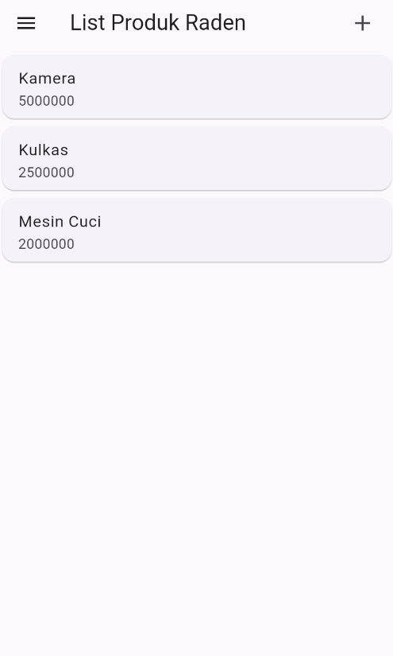
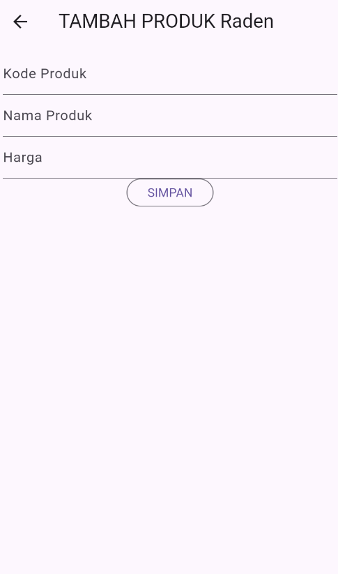
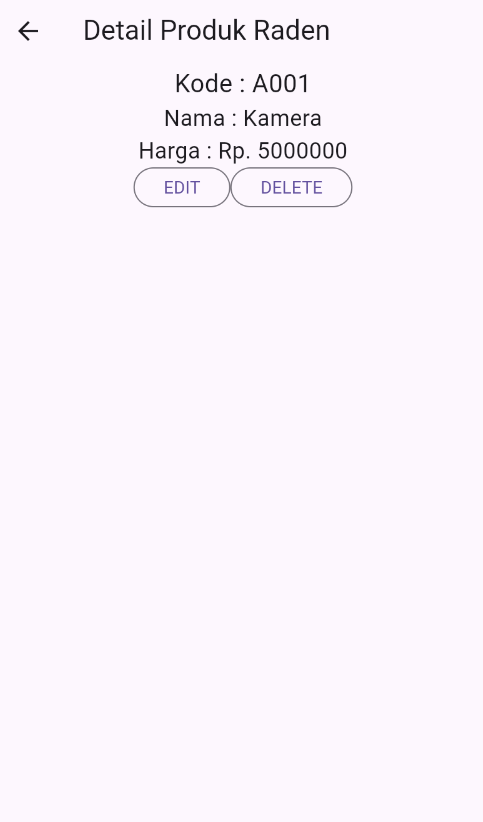
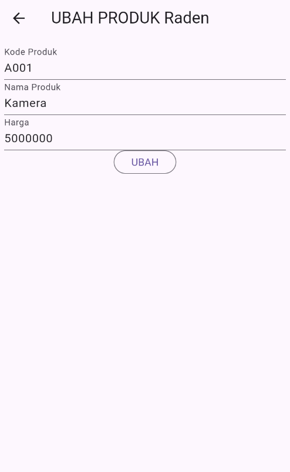

# Toko Kita - Aplikasi Manajemen Produk

Aplikasi Flutter untuk mengelola produk toko dengan fitur CRUD (Create, Read, Update, Delete).

## Screenshot aplikasi

## Struktur Halaman

### **main.dart**

Entry point aplikasi yang menjalankan `ProdukPage` sebagai halaman utama.

### **login_page.dart**

- Form login dengan validasi email dan password
- Tombol navigasi ke halaman registrasi

### **registrasi_page.dart**

- Form registrasi user baru
- Validasi: nama (min 3 karakter), email (format valid), password (min 6 karakter), konfirmasi password

### **produk_page.dart**

- Menampilkan daftar produk dalam ListView
- Tombol tambah produk baru (ikon +)
- Menu drawer dengan opsi logout
- Navigasi ke detail produk saat item diklik

### **produk_form.dart**

- Form untuk tambah/edit produk
- Field: kode produk, nama produk, harga
- Auto-detect mode (tambah/ubah) berdasarkan parameter produk
- Validasi semua field wajib diisi

### **produk_detail.dart**

- Menampilkan detail lengkap produk (kode, nama, harga)
- Tombol EDIT: navigasi ke form edit
- Tombol DELETE: konfirmasi hapus dengan dialog
